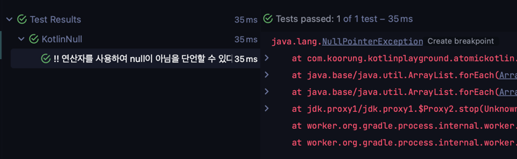
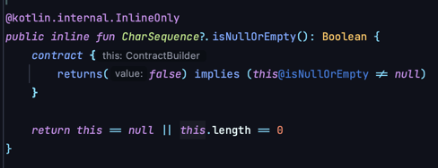

## Atom38 : 코틀린의 null처리 방법

```kotlin
    @Test
    fun `코틀린에서 nullable한 타입은 역참조를 할 수 없다`() {
        val nullable: Nullable? = Nullable("10", 20, false)

        // 0. nullable한 타입의 역참조는 컴파일 오류가 발생함
        // nullable.a

        // 1. if로 null처리
        if(nullable != null) {
            println(nullable.a)
        }

        // 2. 세이프티 콜
        println(nullable?.a)     // "10"
    }
```
코틀린에서 Nullable 객체에 대한 역참조는 객체가 null이 아니더라도 애초에 `컴파일에러` 가 발생한다.

<br/>

```kotlin
    @Test
    fun `!! 연산자를 사용하여 null이 아님을 단언할 수 있다`(){
        val isNotNull: Nullable? = Nullable("10", 20, true)
        val isNull: Nullable? = null

        assertThat(isNotNull!!.a).isEqualTo("10")
        // java.lang.NullPointerException이 발생한다.
        assertThrows<NullPointerException> { isNull!!.a }.printStackTrace()
    }
```


> 💡 단언문은 자바와 동일하게 NPE를 던질 가능성이 있다! (웬만해서는 사용하지 말것)

<br/>

```kotlin
    @Test
    fun `코틀린에서 제공하는 Nullable 처리 함수`(){
        val nullable: String? = "a"
        val nullable2: String? = null
        val nullable3: String? = "      "

        assertThat(nullable.isNullOrEmpty()).isFalse()  // null이거나 "" 인 경우 탐지
        assertThat(nullable2.isNullOrEmpty()).isTrue()
        assertThat(nullable3.isNullOrBlank()).isTrue()  // null이거나 "    "와 같이 공백인 경우 탐지
    }
```
코틀린에서 Nullable 타입에 대해 자체적으로 제공하는 확장함수가 존재한다.


<br/>
`CharSequence?` 의 확장함수 <span style="color : green">*isNullOrEmpty*</span>